# Expo Project 시작과 기본 구조

## 1. Expo Project 시작
- node.js와 npm이 기본적으로 설치가 되어 있어야 한다.
- `npm install -g expo-cli` 커맨드로 expo cli를 설치.
- `expo init [project 이름]` 커맨드로 expo 프로젝트 뼈대를 만든다.

## 2. React-Native Expo 기본 구조
2.1. 프로젝트 처음 형성 시 App.js의 구조 
```javascript
import React, {Component} from 'react'
import {View, Text, StyleSheet} from 'react-native'

export default class App extends Component{
    render(){
        return(
            <View style={styles.container}>
                <Text>Hello World.</Text>
            </View>
        )
    }
}

const styles = StyleSheet.create({
    container: {
        flex: 1,
        backgroundColor: "#fff",
        alignItems: 'center',
        justifyContent: 'center'
    }
})
```
- react native가 제공하는 컴포넌트(ex. StatusBar)를 추가로 사용하려면 react-native로부터 추가로 import 해주어야 한다(보통 자동으로 됨).
- View 태그는 OS에 따라 Objective-C(ios), Java(android)로 변환된다.
- render() 내부에서는 꼭 return을 해주어야 한다.
- StyleSheet을 이용하여 각 컴포넌트의 style을 정해줄 수 있다(아래에서 더 자세히 설명).

2.2. 추가 컴포넌트 선언 및 사용
```javascript
import Weather from './weather';

export default class App extends Component{
    render(){
        return(
            <View style={styles.container}>
                <Weather />
                <Text>Hello World.</Text>
            </View>
        )
    }
}
```
- weather.js라는 파일을 새로 생성하여 기본 App.js와 같은 형태로 새로운 컴포넌트를 작성
- App.js에서는 해당 파일을 import하여 바로 태그처럼 사용 가능하다.

2.3. 속성
- state: 해당 컴포넌트 내에서 사용할 변수
```javascript
export default class App extends Component {
  state = {
    isLoaded: true
  }

  render(){
    const {isLoaded} = this.state;

    return (
      <View style={styles.container}>
        <StatusBar hidden={true} />
        {isLoaded ? 
        <Weather /> : 
        <View style={styles.loading}>
          <Text style={styles.loadingText}>Getting Weather... Please wait</Text>
        </View>}
      </View>
    );
  }
}
```
```
- state는 중괄호로 감싸주며 javascript의 object 형태로 값을 할당한다.
- render에서 state의 값을 사용할 때에는 위에서와 같이 const {변수} = this.state; 로 불러와 사용한다.
```
- style: css와 비슷하게 사용되며, 그 중 일부 중요 속성 정리
```javascript
export default class App extends Component{
    render(){
        return(
            <View style={styles.container}>
                <View style={style.sample1} />
                <View style={style.sample2} />
            </View>
        )
    }
}

const styles = StyleSheet.create({
    container: {
        flex: 1,
        backgroundColor: "#fff",
        alignItems: 'center',
        justifyContent: 'center'
    },
    sample1: {
        flex: 1,
        alignSelf: 'flex-end'

    },
    sample2: {
        flex: 1,
    }
})
```
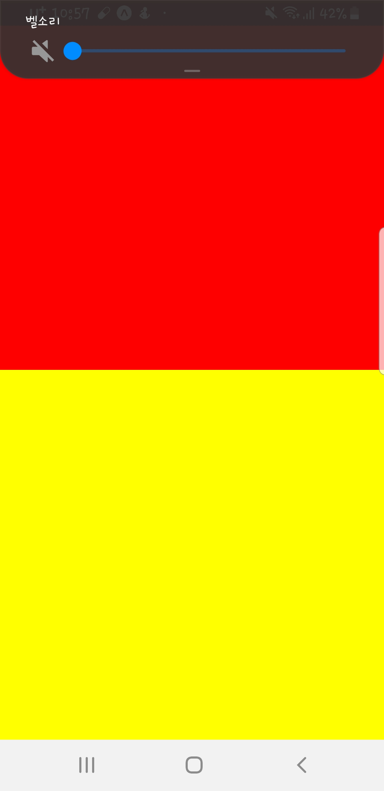
```
- flex: 같은 계급의 다른 component들과의 비율을 정할때 사용, 여기서는 메인 View 내부에 sample1, 2 두개의 component가 있는데, flex가 각각 1임으로 반반을 꽉 채우게 됨
- alignItems: 가로방향에서의 배치를 결정
- alignSelf: 자기 자신의 배치를 결정
- justifyContent: 세로방향에서의 배치를 결정
- alignItems, justifyContent 공통의 옵션
    1. 'center': 중앙 배치
    2. 'flex-start': 왼쪽 혹은 위에 붙여서 배치
    3. 'flex-end': 오른쪽 혹은 아래에 붙여서 배치
    4. 'space-between': 각 컴포넌트를 위아래 혹은 왼오른쪽 끝에 붙여서 배치
    5. 'space-around': 각 컴포넌트를 위아래 혹은 왼오른쪽 어느정도 떨어트려서 배치
```
2.4. 외부 컴포넌트 사용
- StatusBar: 작업창 맨 위의 상태바를 컨트롤 할 수 있다.
```javascript
import { StyleSheet, Text, View, StatusBar } from 'react-native';

export default class App extends Component{
    render(){
        return(
            <StatusBar hidden={true} />

        )
    }
}
```
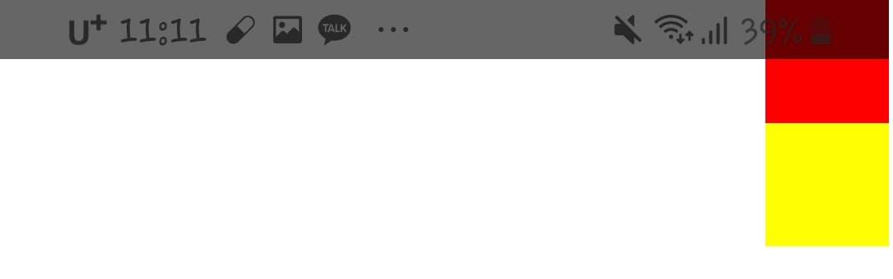
```
- 위와같이 hidden={true}로 설정하면 상태바를 아예 없앨 수 있다.
- barStyle="dark-content" 옵션을 주면 상태바 내부 아이콘들이 검은색으로 표시된다.
```
- Ionicons: Expo에서 제공하는 기본 아이콘들을 사용할 수 있다.
```javascript
import {Ionicons} from '@expo/vector-icons';

export default class App extends Component{
    render(){
        return(
            <Ionicons color="white" size={144} name="ios-rainy"/>
        )
    }
}
```

```
- expo의 vector icon으로 접속하면 각 아이콘의 이름을 찾을 수 있다.
- color, size, name 등의 속성을 설정할 수 있다.
```

2.5. FlexBox
- flex 조정: 아래와 같이 flex를 조정하여 실제 앱의 메뉴바처럼 구현이 가능하다.
```javascript
export default class App extends Component {

  render(){
    return (
      <View style={styles.container}>
          <View style={styles.sample1}/>
          <View style={styles.sample2}/>
      </View>
    );
  }
}

const styles = StyleSheet.create({
  container: {
    flex: 1,
  },
  sample1: {
    flex: 1,
    backgroundColor: "red",
  },
  sample2: {
    flex: 6,
    backgroundColor: "yellow",
  }
});
```
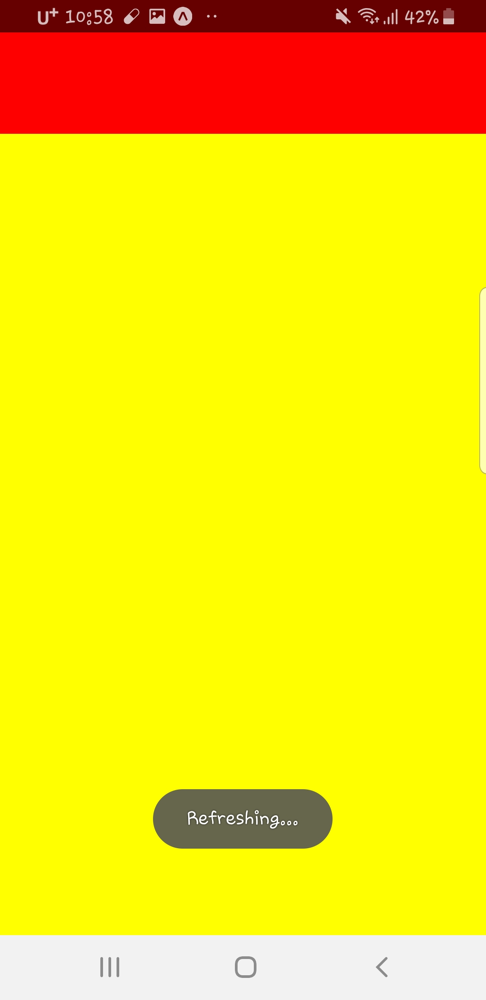
- flexDirection: 기본적으로 컴포넌트들의 배치 default는 column(세로방향)이다. 다음은 row(가로방향으로 수정한 모습)
```javascript
const styles = StyleSheet.create({
  container: {
    flex: 1,
    flexDirection: 'row'
  },
  sample1: {
    height: 50,
    width: 50,
    backgroundColor: "red",
  },
  sample2: {
    height: 50,
    width: 50,
    backgroundColor: "yellow",
  }
});
```
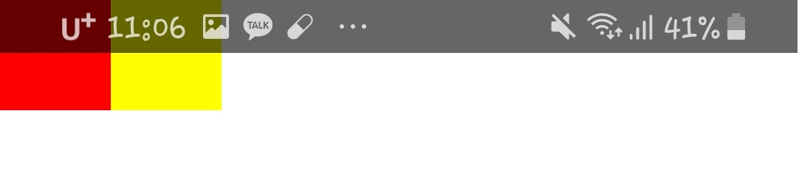
- justifyContent: 세로방향 정렬
    1. center
    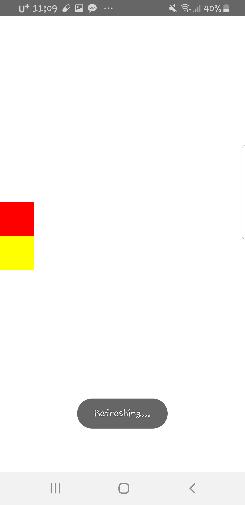
    2. flex-start
    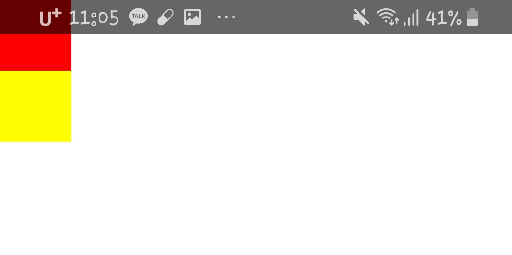
    3. flex-end
    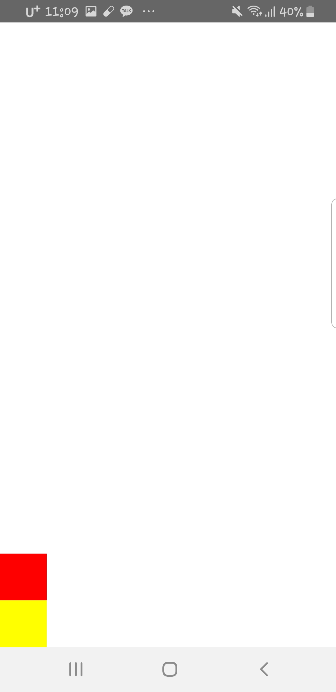
    4. space-between
    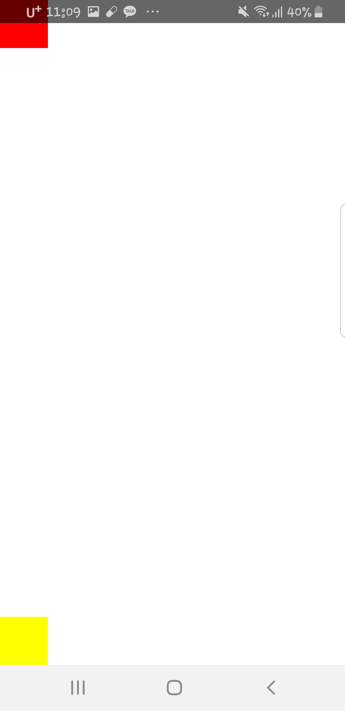
    5. space-around
    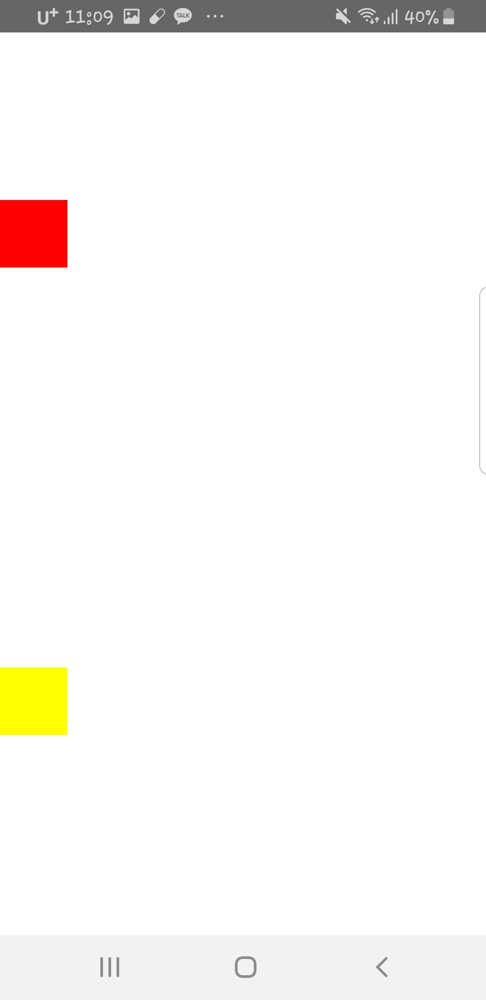
- alignItems: 가로방향 정렬
    1. center
    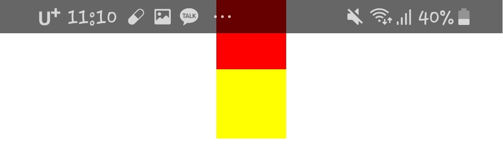
    2. flex-end
    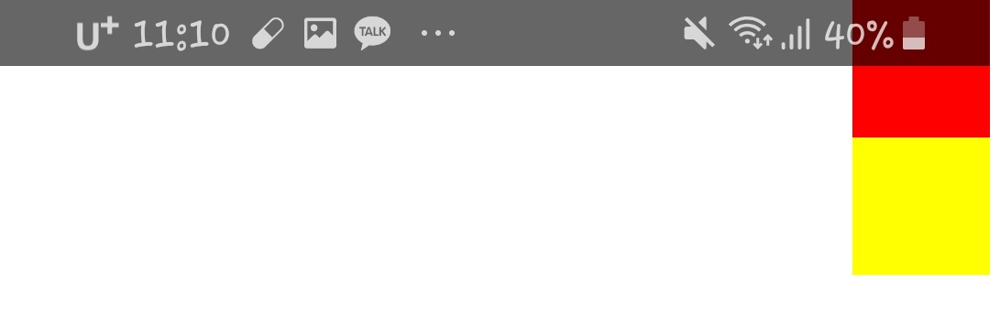

## 3. 결과물(2020.02.11)
- 날씨 표시할 화면(data는 임의로 하드코딩)
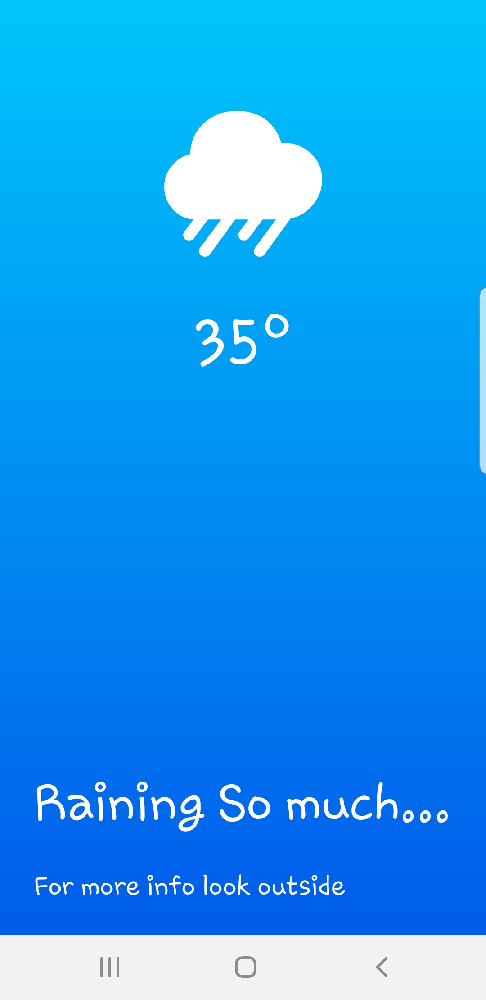
